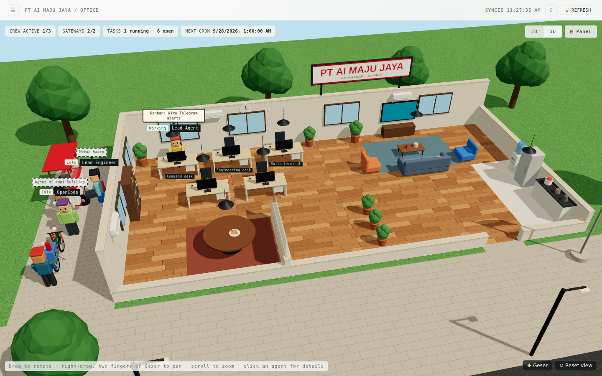
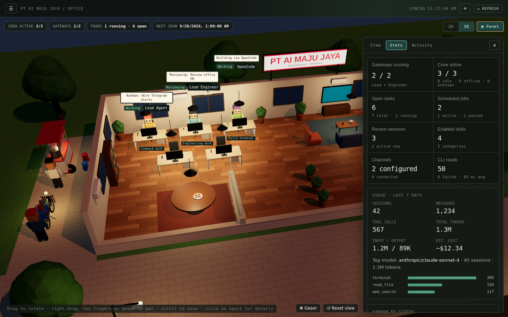

# PT AI Maju Jaya · 3D Office

**Kantor 3D buat budak korporat AI-mu.** Mission control dan kantor 3D *read-only* untuk tim [Hermes Agent](https://hermes-agent.nousresearch.com) dan OpenCode di mesinmu. Lihat siapa yang lagi kerja dan sedang ngapain, plus Kanban, cron job, sesi, memory, folder, dan log, semuanya di satu tempat. Semua data dibaca lewat CLI `hermes`, dan tidak ada yang pernah diubah.

> *English: a read-only mission control and 3D office for your Hermes Agent + OpenCode crew. Install with the one-liner below, then run `majujaya`.*





## Instalasi

Bisa di macOS, Linux, dan Windows lewat WSL2. Yang dibutuhkan hanya CLI Hermes Agent (`hermes`) yang sudah terpasang; `opencode` opsional. Kalau belum ada Node.js 20 atau lebih baru, installer akan mengunduh Node.js sendiri.

```bash
curl -fsSL https://raw.githubusercontent.com/yugienugraha/pt-ai-maju-jaya/main/install.sh | bash
```

Lalu jalankan dan buka http://127.0.0.1:3001:

```bash
majujaya                     # atau: majujaya --port 3005
```

- **Jalan di background dan otomatis saat boot (Linux):** tambahkan `--service` untuk memasang systemd user service:
  `curl -fsSL https://raw.githubusercontent.com/yugienugraha/pt-ai-maju-jaya/main/install.sh | bash -s -- --service`
  Supaya tetap jalan setelah kamu logout, jalankan juga `loginctl enable-linger $USER`.
- **Update:** jalankan lagi perintah instalasinya.
- **Hapus:** tambahkan `--uninstall` (`... | bash -s -- --uninstall`).
- **Opsi lain:** `--version v0.2.0` memasang rilis tertentu; `--from-source` membangun dari `main` terbaru (butuh `git`). Lihat `install.sh --help`.
- **Di server:** PT AI Maju Jaya hanya mendengarkan di `127.0.0.1`. Dari laptop, jalankan `ssh -L 3001:127.0.0.1:3001 user@server`, lalu buka http://127.0.0.1:3001.

Semua dipasang di `~/.local/share/pt-ai-maju-jaya`, ditambah perintah `majujaya` di `~/.local/bin`. Instalasi lama dengan nama sebelumnya (Mission Control) otomatis dibersihkan. Tidak memakai sudo dan tidak ada yang dipasang ke sistem. Mau baca script-nya dulu sebelum menjalankan? `curl -fsSL https://raw.githubusercontent.com/yugienugraha/pt-ai-maju-jaya/main/install.sh -o install.sh`, baca, lalu `bash install.sh`.

**Pakai Node.js 20+ milikmu sendiri:** unduh `pt-ai-maju-jaya.tgz` dari [rilis terbaru](https://github.com/yugienugraha/pt-ai-maju-jaya/releases/latest) lalu jalankan `npm install -g ./pt-ai-maju-jaya.tgz`. Setelah paketnya terbit di npm, cukup `npm install -g pt-ai-maju-jaya` (atau `npx pt-ai-maju-jaya`).

## Pengembangan

Butuh Node.js 20+ dan `hermes` di `PATH` shell yang menjalankan server.

```bash
git clone https://github.com/yugienugraha/pt-ai-maju-jaya.git
cd pt-ai-maju-jaya
npm install
npm run dev        # API di 127.0.0.1:3001 + UI Vite (buka URL yang ditampilkan Vite, biasanya http://localhost:5173)
```

Mode produksi dari checkout (satu proses, menyajikan UI hasil build dan API):

```bash
npm run build      # build UI ke dist/ dan server ke build/server/
npm start          # buka http://127.0.0.1:3001
```

Pengecekan: `npm run lint`, `npm test`, `npm run build`.

**Setelah menarik kode baru**, jalankan `npm install && npm run build` lalu restart `npm start` (`npm start` yang sedang jalan tetap menyajikan API lama; `npm run dev` me-restart API sendiri). UI mengecek `/api/health` dan menampilkan banner *Restart needed* kalau server lebih lama dari halamannya. Atur `MAJUJAYA_PORT` (atau pakai `--port`) untuk mengganti port. Server hanya bind ke `127.0.0.1`.

**Merilis versi baru:** naikkan versi lalu push tag-nya, misalnya `npm version 0.2.1 && git push origin main --follow-tags`. Workflow *Release* lalu menjalankan lint, test, dan build, kemudian melampirkan `pt-ai-maju-jaya.tgz` ke GitHub Release, yang akan diambil oleh installer. Untuk sekalian menerbitkan ke npm, tambahkan repository secret `NPM_TOKEN`.

## Halaman

- **Agents**: rantai agen yang dideklarasikan (Lead Agent → Lead Engineer → OpenCode) dengan profil, model, dan status gateway, plus profil Hermes lainnya.
- **Office** (halaman utama): kantor mengisi layar di bawah header. HUD di bagian atas menampilkan crew aktif, gateway yang berjalan, task running/open, jadwal cron berikutnya, dan (kalau ada) CLI read yang gagal; setiap chip menuju halamannya. Tombol **Panel** membuka satu panel samping dengan tiga tab: **Crew** (ringkasan crew dan daftar station yang bisa diklik), **Stats** (dulu Dashboard: statistik dari semua sumber, pemakaian 7 hari dari `hermes insights`, sebaran status Kanban, runtime, dan jadwal terdekat; setiap tile menuju halamannya) dan **Activity** (metadata sesi tanpa atribusi dan channel messaging). `#/dashboard` membuka Office.

  Tampilan bisa diganti antara **3D** (bawaan) dan **2D**, dan pilihannya diingat per browser; browser tanpa WebGL tetap di 2D. Tampilan 3D (three.js lewat React Three Fiber, hanya dimuat saat dipakai) adalah kantor kecil ala Indonesia:
  - lantai parket, meja dengan monitor, dan meja rapat dengan gorengan
  - lounge dengan sofa yang menghadap TV di tembok belakang
  - pantry dengan dispenser galon
  - AC split di dinding (unit outdoor-nya di belakang gedung) dan papan nama **PT AI MAJU JAYA** di atap
  - bendera Merah Putih di pintu masuk
  - di gang samping gedung, di luar pandangan utama: gerobak bakso dan kopi keliling bersepeda, masing-masing dengan penjualnya

  Suasananya mengikuti tema: siang di mode terang, malam di mode gelap, saat lampu gantung, lampu jalan, lampu gerobak, dan papan nama menyala. Hanya memakai tekstur prosedural, tanpa file gambar atau model. Seret untuk memutar, scroll untuk zoom, dan geser dengan klik kanan + seret, dua jari, tombol panah, atau tombol **Geser** (membuat seret biasa jadi menggeser). Pergeseran dibatasi di area kantor, dan **Reset view** mengembalikan tampilan awal.

  Setiap agen punya meja sendiri. Agen yang sedang membalas chat berjalan ke meja rapat; yang menjalankan cron job, tools, atau task Kanban duduk di mejanya dengan balon kata berisi apa yang sedang dikerjakan. Agen berjalan lewat lorong dan pintu masuk, tidak pernah menembus furnitur atau tembok. Agen yang idle tidak cuma duduk: setiap 32 detik mereka pindah ke tempat lain, misalnya santai di lounge, ambil air galon, ke dapur, makan bakso di kursi plastik gerobak, ngopi di sepeda kopi, atau jalan-jalan ke tiang bendera atau rak buku. Balon putus-putus menunjukkan mereka sedang di mana. Jalan-jalan ini murni dekorasi (rute berbasis jam yang sama untuk semua), sedangkan status Idle-nya tetap berasal dari server. Klik agen untuk membuka dialog detail.
- **Task Board**: Kanban Hermes sesuai urutan papan (triage → todo → scheduled → ready → running → blocked → review → done) dengan pencarian, filter assignee, dan prioritas. Klik kartu untuk detail lengkap dari `hermes kanban show <id> --json`: deskripsi, hasil atau ringkasan terakhir, workspace, branch, skill, model, waktu, dependensi (bisa diklik), run, komentar, dan aktivitas. Teks bebas disensor dari rahasia; hanya id yang ada di papan saat ini yang bisa dibuka.
- **Calendar**: cron job Hermes dengan status, jadwal berikutnya, yang terlambat, dan hasil run terakhir.
- **Activity**: 20 sesi terbaru dengan pencarian.
- **Memory**: per agen, apa yang dibawa ke setiap sesi (mengikuti dokumentasi memory dan context file Hermes):
  - `SOUL.md` (identitas, slot #1 system prompt)
  - `memories/MEMORY.md` (catatan agen) dan `memories/USER.md` (profil pengguna), dipecah per entri `§`, dengan bar pemakaian terhadap batas yang dikonfigurasi (bawaan 2.200 / 1.375 karakter dari `memory.*` di `config.yaml`) dan peringatan di atas 80%
  - context file yang ada di profil (`HERMES.md`, `.hermes.md`, `AGENTS.override.md`, `AGENTS.md`, `CLAUDE.md`, `.cursorrules`)
  - pengaturan memory (store yang aktif, `write_approval`, provider eksternal)

  OpenCode menampilkan `AGENTS.md`/`CLAUDE.md` global-nya. Entri bisa dicari. Semuanya dibaca lewat lapisan keamanan Folders, jadi *read-only*, terbatas di folder agen, dan rahasianya disensor. `#/knowledge` membuka halaman ini.
- **Folders**: satu folder per agen, dan hanya folder agen itu: Lead Agent → `~/.hermes/profiles/default`, Lead Engineer → `~/.hermes/profiles/leadengineer`, OpenCode → `~/.opencode`. Jelajahi sub-folder dan lihat file secara *read-only*. Lihat bagian *Folders* di bawah.
- **Logs**: ekor dari `hermes logs agent|gateway|errors` dengan filter level, pencarian, dan mode follow, plus audit setiap perintah yang dijalankan server (tab *Command audit*).

Navigasi berupa drawer yang tertutup secara bawaan, seperti menu game: buka dengan tombol ☰ atau tombol **M**, dan tutup dengan Esc, klik di luar, atau dengan memilih halaman. Titik di ☰ menandakan ada CLI read yang gagal atau gateway yang berhenti. Header punya satu tombol tema terang/gelap (diingat per browser) dan Refresh. Semua halaman memperbarui data otomatis, tetap menampilkan data terakhir yang valid (ditandai *stale*) kalau refresh gagal, dan bisa di-refresh manual. "Refresh all" melewati cache server 10 detik untuk data yang lebih lama dari 2 detik. Setiap halaman punya alamat hash URL (misalnya `#/task-board`).

## Data dan keamanan

Server hanya memakai perintah tetap berikut, dan semuanya *read-only*:
- `hermes profile list`, `hermes -p leadengineer gateway status`, `opencode --version`
- `hermes kanban list --json`, `hermes kanban show <id> --json` (detail task)
- `hermes cron list --all`, `hermes sessions list --limit 20`, `hermes skills list --enabled-only`
- `hermes status --all`, `hermes insights --days 7`, `hermes logs <agent|gateway|errors> -n 200`
- untuk aktivitas live di Office: `hermes -p <default|leadengineer> logs agent -n 80 --since 3m` dan `hermes -p <default|leadengineer> sessions list --limit 3`

Detail eksekusinya:
- Perintah dijalankan dengan `NO_COLOR=1` dan `COLUMNS` yang lebar supaya format teksnya bisa di-parse dengan andal.
- Status gateway default diambil dari `hermes profile list`; tidak ada perintah gateway default terpisah.
- Setiap perintah dijalankan dengan `execFile` dan timeout proses 8 detik. Hasil endpoint-nya di-cache 10 detik (insights: 60 detik; logs: 5 detik), dan request yang bersamaan berbagi satu pembacaan yang sedang berjalan.
- Input dari browser tidak pernah sampai ke perintah shell.

Yang diekspos hanya data yang sudah dinormalisasi:
- profil/model, status gateway, versi OpenCode
- judul/status Kanban dan field cron yang dikenali
- judul/preview/terakhir-aktif/ID sesi
- field tabel skill aktif yang dikenali
- nama platform messaging yang dikonfigurasi dengan status umum configured/connected, dan jumlah sesi aktif kalau bisa dikenali dengan aman

Baris log adalah satu-satunya pengecualian yang disengaja dari "tidak ada output mentah". Baris log dikembalikan setelah dua lapis sensor: sensor rahasia milik Hermes sendiri, lalu sensor kedua dari server (API key, bearer token, rahasia `key=value`, bot token). Path home disingkat menjadi `~`, dan baris header `hermes logs` (yang berisi path) dibuang. Teks error cron dari run terakhir tidak pernah dikembalikan, hanya ok/gagal.

Selain itu, yang tidak pernah dibaca atau dikembalikan: output CLI mentah, detail proses, path, konfigurasi, kredensial, autentikasi, API key, file environment, detail provider, dan database sesi. Sumber yang gagal ditampilkan sebagai `Not Available`; field individual yang tidak dikenal ditampilkan sebagai `Unknown`.

Endpoint `/api/tasks`, `/api/calendar`, `/api/activity`, dan `/api/knowledge` masing-masing mengembalikan status ketersediaan sumber dan waktu refresh:
- Task Board *read-only* dan tidak menyediakan mutasi.
- Calendar hanya berisi cron, jadi sengaja tidak memuat event umum.
- Activity terbatas pada metadata daftar sesi dan tidak mengarang event.
- Knowledge adalah katalog skill aktif yang dikenali dari tabel Rich Hermes.

Hasil sumber yang kosong tetap dianggap tersedia dan ditampilkan apa adanya; output yang tidak bisa di-parse dan perintah yang gagal ditampilkan sebagai `Not Available`. Aksi tulis ke Hermes memang sengaja tidak diimplementasikan.

## Office

`/api/office` adalah gabungan *read-only* dari pembacaan runtime, Kanban, dan aktivitas yang sudah di-cache. Ada tiga station tetap: Lead Agent (command desk), Lead Engineer (engineering desk), dan OpenCode (build terminal). Peran, palet karakter, workstation, dan anatomi karakter pixel CSS-nya adalah metadata statis. Tampilan 2D menyediakan ruang Workspace dan Lounge berbasis CSS saja: Workspace berisi meja dan area kolaborasi, Lounge menempatkan karakter idle di samping sofa dan kursi. Tidak ada aset gambar.

Status Office selalu salah satu dari `Idle`, `Working`, `Reviewing`, `Collaborating`, `Offline`, atau `Unknown`. Urutan prioritasnya:
1. Gateway milik station yang `Stopped` membuat Lead Agent atau Lead Engineer `Offline`.
2. Overlay status eksplisit internal yang masih baru dan belum kedaluwarsa bisa menyatakan `Working`, `Reviewing`, atau `Collaborating`.
3. Task Kanban baru yang secara eksplisit di-assign ke station: `running` jadi `Working`, `review` jadi `Reviewing`.
4. Sesi aktif baru yang punya atribusi aktor jadi `Collaborating`.
5. Selain itu, berlaku kebijakan managed-idle.

Managed Idle adalah kebijakan penempatan yang transparan dari server, bukan kehadiran yang dilaporkan agen. Status ini hanya berlaku kalau semua syarat berikut terpenuhi:
- pembacaan runtime, Kanban, dan aktivitas yang baru tersedia
- gateway milik station tidak berhenti
- tidak ada overlay eksplisit yang baru
- Kanban tidak punya task running/review milik agen itu
- aktivitas tidak punya sesi aktif milik agen itu

Station lalu ditempatkan di Lounge dengan label `Idle · managed placement`. Kalau ada input wajib yang tidak tersedia atau sudah basi, station jadi `Unknown`. Gateway `Running`, sesi umum, task Kanban tanpa assignee, dan ketersediaan versi OpenCode tidak bisa membuat status aktif sendirian; ketersediaan versi OpenCode secara eksplisit bukan sinyal status.

Task saat ini dan aktivitas terbaru butuh atribusi aktor. Office hanya menampilkan task Kanban kalau assignee eksplisitnya cocok dengan alias station di atas. Metadata daftar sesi Hermes saat ini belum punya atribusi aktor, jadi panel Activity melabelinya sebagai metadata sesi tanpa atribusi dan tidak pernah memasangkannya ke station. Sumber task atau aktivitas yang gagal tetap bermakna `Not Available`: itu soal ketersediaan sumber, bukan status kerja di Office. Memilih station membuka dialog detail di halaman yang bisa dipakai dengan keyboard, berisi ruang, asal-usul data (*provenance*), dan kesegaran sumber.

Penempatan status divisualisasikan tanpa mengarang pekerjaan:
- `Working`, `Reviewing`, dan `Collaborating` ada di Workspace.
- `Idle` ada di Lounge.
- `Offline` diredupkan di station workspace-nya.
- `Unknown` ditampilkan di posisi netral berlabel di Workspace.

Ringkasan crew menghitung station yang dideklarasikan, kerja aktif (`Working`/`Reviewing`/`Collaborating`), managed idle, offline, dan unknown secara terpisah. Kesehatan gateway (berapa dari dua gateway station yang `Running`) sengaja ditampilkan sebagai metrik tersendiri. Kalau satu station punya beberapa task Kanban, yang `running` menang, lalu `review`, lalu task terbuka pertama.

`/api/channels` adalah snapshot aman terpisah yang hanya diambil dari bagian Messaging Platforms dan jumlah sesi aktif di `hermes status --all`; platform yang tidak dikonfigurasi dan isi status lainnya tidak pernah diekspos. Office tidak menambah endpoint tulis, input shell, atau perintah di luar daftar tetap di atas.

## Aktivitas live di Office

Setiap profil Hermes menulis semua pekerjaannya ke `agent.log` masing-masing: balasan messaging (gateway), run cron, pemanggilan tools, dan loop agen. Untuk dua profil station, server membaca 3 menit terakhir dari log tersebut dan sesi terbaru profilnya:

- Baris pesan gateway bersama baris agent-loop atau tools, atau sesi yang aktif dalam 3 menit terakhir, menjadi `Collaborating` ("Replying to a chat", di meja rapat).
- `cron.*` menjadi `Working` ("Running a scheduled job"); `tools.*` menjadi `Working` ("Using tools"); `agent`/`run_agent` menjadi `Working` ("Working on a request").
- OpenCode `Working` kalau baris log agen terbaru menunjukkan OpenCode sedang dijalankan.

Urutan prioritasnya:
1. overlay eksplisit
2. aktivitas live (task Kanban running/review, kalau ada, dipakai sebagai label pekerjaan itu)
3. gateway berhenti (`Offline`)
4. task Kanban
5. managed `Idle` di Lounge

Kerja live mengalahkan gateway yang berhenti karena kerja CLI dan cron tidak membutuhkan gateway. Noise polling gateway dan baris housekeeping CLI diabaikan.

## Folders

Setiap agen diarahkan ke foldernya sendiri:

| Agen | Folder |
|---|---|
| Lead Agent (`default`) | `<hermes root>/profiles/default`; hanya kalau folder itu tidak ada (susunan standar Hermes), root Hermes itu sendiri |
| Lead Engineer dan profil Hermes lainnya | `<hermes root>/profiles/<nama>` |
| OpenCode | `~/.opencode`, lalu `~/.config/opencode` (bisa ditimpa dengan `MAJUJAYA_OPENCODE_DIR`) |

Root Hermes mengikuti aturan Hermes sendiri (`HERMES_HOME`, bawaannya `~/.hermes`); `MAJUJAYA_HERMES_ROOT` bisa menimpanya.
- Agen non-default yang mengarah ke root Hermes, atau ke folder yang sudah dimiliki agen lain, ditampilkan sebagai tidak tersedia beserta alasannya alih-alih dibuka.
- Kalau folder satu agen berisi folder agen lain (root standar berisi `profiles/`), sub-folder itu disembunyikan dan tidak bisa dibaca lewat agen luar.
- Kartu dan breadcrumb menampilkan path aslinya.

`/api/folders` menampilkan daftar agen; `/api/folders/<agent>/list?path=` dan `/api/folders/<agent>/file?path=` menjelajahi satu folder. Aturan keamanannya:
- Setiap path di-resolve (termasuk symlink) dan harus tetap di dalam folder agen itu.
- Instalasi `hermes-agent`, `.git`, virtualenv, dan cache disembunyikan.
- File yang berisi kredensial atau database (`.env*`, `auth.json`, key dan sertifikat, nama yang mengandung token/secret/password/credential, file `*.db`/SQLite) ditampilkan di daftar tapi tidak pernah dibaca.
- Preview teks dibatasi 256 KB dan melewati sensor rahasia yang sama dengan log. File biner tidak di-preview.

**Mengatasi "This folder could not be read".** Server membaca folder sebagai user yang menjalankannya. Kalau folder profil milik user lain atau ber-mode `700` (misalnya dibuat oleh gateway yang dijalankan dengan `sudo`/systemd sebagai root), kartunya menampilkan "No read permission for <user>", dan saat dibuka dijelaskan user mana yang ditolak. Cek dengan `ls -ld ~/.hermes/profiles/<nama>`. Perbaiki dengan mengembalikan kepemilikan folder ke user-mu (`sudo chown -R $USER:$USER ~/.hermes/profiles/<nama>`) atau memberi akses baca (`sudo setfacl -R -m u:$USER:rX ~/.hermes/profiles/<nama>`).
